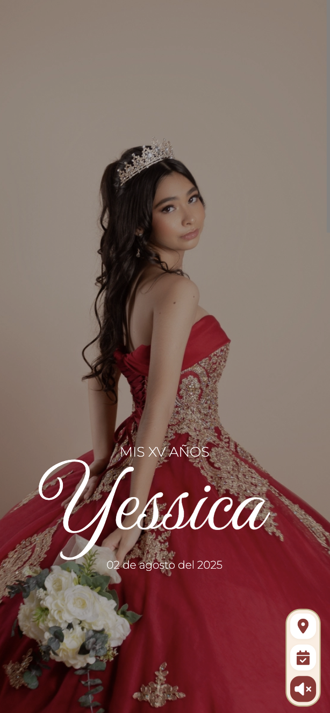
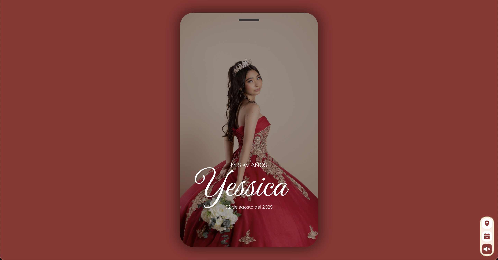

# Invitación XV Yessica Perera Barrera

¡Bienvenido/a! Este proyecto es una invitación digital interactiva y responsiva para la celebración de XV años de Yessica Perera Barrera. Está diseñado para ofrecer una experiencia elegante, moderna y funcional tanto en dispositivos móviles como en escritorio. Al igual que un sistema de asistencia de manera intuitiva y sencilla

---

## 📱 Vista móvil

<!-- Agrega aquí una imagen de la página en móvil -->


## 💻 Vista escritorio

<!-- Agrega aquí una imagen de la página en desktop -->


---

## ✨ Funcionalidades principales

- **Responsive Design:** Se adapta perfectamente a cualquier dispositivo (móvil, tablet, desktop) utilizando unidades relativas y media queries para lograr una experiencia óptima.
- **Diseño moderno y elegante:** Inspirado en tendencias actuales de invitaciones digitales, con tipografías y colores cuidadosamente seleccionados.
- **Carga elegante:** Animación de loader inicial para mejorar la experiencia de usuario.
- **Portada personalizada:** Imagen de portada con nombre y fecha destacados.
- **Sección de agradecimientos y padres:** Mensajes personalizados y visualmente atractivos.
- **Cuenta regresiva:** Timer animado hasta el día del evento.
- **Detalles del evento:** Información clara y accesible sobre iglesia, recepción, código de vestimenta, etc.
- **Confirmación de asistencia:** Integración con Google Forms y AppScript para registrar la asistencia de los invitados de forma automática y segura.
- **Galería de fotos:** Galería interactiva con modal y animaciones
- **Navbar flotante:** Barra de navegación flotante con accesos rápidos y control de música.
- **Animaciones suaves:** Transiciones y efectos visuales modernos en toda la página.
- **Código JavaScript modular:** Todo el JS está organizado en módulos por funcionalidad, facilitando el mantenimiento y la escalabilidad del proyecto.

---

## 🛠️ Buenas prácticas y ventajas técnicas

- **Modularidad en JavaScript:** Todo el código JS está separado por funcionalidades (loader, galería, navbar, confirmación, etc.), lo que facilita la lectura, el mantenimiento y la extensión del proyecto.
- **Integración con Google AppScript:** El formulario de confirmación de asistencia utiliza Google Forms y un script de AppScript para almacenar las respuestas de los invitados de manera automática y segura.
- **Responsive real:** El diseño utiliza unidades relativas (vw, vh, rem) y media queries para adaptarse a cualquier pantalla, simulando incluso un teléfono en escritorio.

---

## 📂 Estructura del proyecto

```
assets/
	css/         # CSS por sección
	js/          # JS modularizado por funcionalidad
	img/         # Imágenes y decoraciones
	audio/       # Música de fondo
index.html     # Página principal
README.md      # Este archivo
```

---

